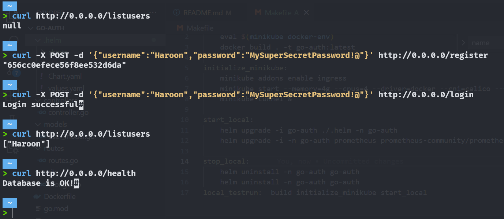

# go-auth

A simple Go service, which serves as an exercise bringing together the power of Golang, MongoDB, Kubernetes, Helm, Prometheus, and more!



### Available endpoints:

* 🌐 Register: `/register` - POST your username and password to embark on your tech journey.
* 🔐 Login: `/login` - Validate your password and prepare for the adventure.
* 📋 List Users: `/listusers` - Discover the vibrant community of registered usernames.
* ❤️ Health Check: `/health` - Ensure the heartbeat of the database with a liveness probe.
* 📈 Metrics: `/metrics` - Revel in Prometheus instrumentation and monitor the heartbeat of your service.


## Installation and Setup Guide for go-auth


### Build go-auth Docker Image

Run the following command to build the go-auth Docker image:

```bash
make build
```

### Initialize Minikube

Enable the necessary Minikube addons and start Minikube with the following commands:

```bash
make initialize_minikube
```

This sets up Minikube with Ingress and starts it with specified resources.

### Start Local Deployment

Deploy go-auth and Prometheus locally using Helm:

```bash
make start_local
```

This command upgrades or installs Helm charts for go-auth and Prometheus in the `go-auth` namespace.

### Stop Local Deployment

To stop the local deployment, use the following command:

```bash
make uninstall
```
This will uninstall the go-auth and Prometheus Helm charts.

### Local Test Run

For a complete local test run, including building, Minikube initialization, and deployment, use:

```bash
make local_testrun
```
This command performs the build, initializes Minikube, and deploys go-auth and Prometheus.

---

## What's Coming Next? 🌟🚀


* need to stop users from being able to register again through /register, instead only allow for changing password through /changepassword
* store users' data in a volume/storage